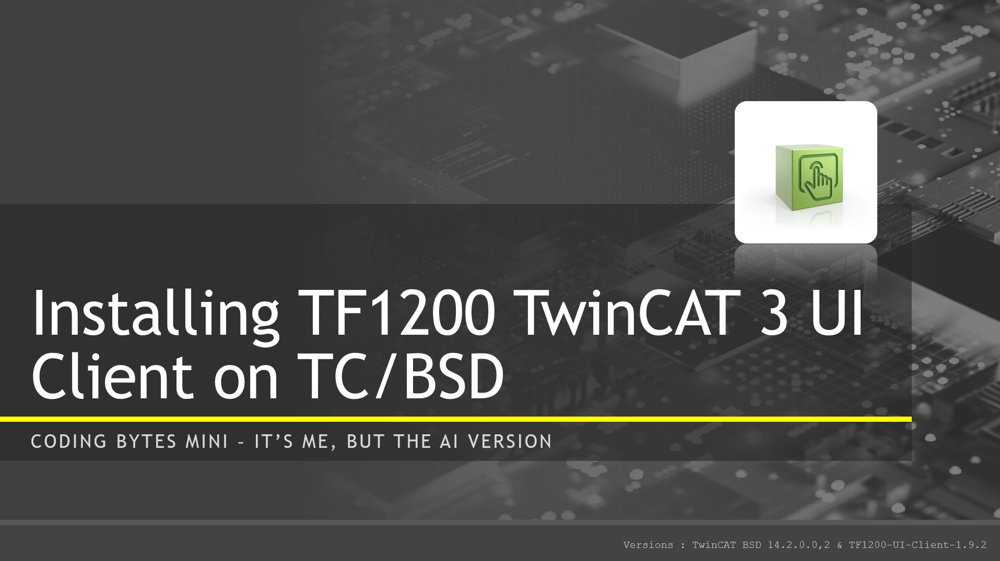

# Coding Bytes Mini - Installing TF1200 TwinCAT UI Client on TC/BSD

## Disclaimer

This is a personal guide not a peer reviewed journal or a sponsored publication. We make
no representations as to accuracy, completeness, correctness, suitability, or validity of any
information and will not be liable for any errors, omissions, or delays in this information or any
losses injuries, or damages arising from its display or use. All information is provided on an as
is basis. It is the reader’s responsibility to verify their own facts.

The views and opinions expressed in this guide are those of the authors and do not
necessarily reflect the official policy or position of any other agency, organization, employer or
company. Assumptions made in the analysis are not reflective of the position of any entity
other than the author(s) and, since we are critically thinking human beings, these views are
always subject to change, revision, and rethinking at any time. Please do not hold us to them
in perpetuity.

## Overview

This repository contains the source files used in the _Coding Bytes Mini_ video series on YouTube. Each video is automatically generated using AI tools for voice and video based on the included files.

## YouTube Video Data

### Link

[YouTube Link](https://www.youtube.com/watch?v=wXO_JyoG_vQ)

### Title

```
Coding Bytes Mini - Installing TF1200 TwinCAT UI Client on TC/BSD
```

### Description

```
Hello everyone, and welcome to Coding Bytes Mini. These videos are quick simple software tutorials, bought to life by my AI-Powered clone. I write the scripts, and my clone handles the production! Today we will be installing TF1200, the TwinCAT 3 UI client on TwinCAT BSD.

Versions :
TwinCAT BSD 14.2.0.0,2
TF1200-UI-Client-1.9.2

Commands used :
doas pkg install TF1200-UI-Client
cd /usr/local/etc/TwinCAT/Functions/TF1200-UI-Client/scripts
doas ./setup-full.sh --user=TF1200 --autologin –autostart
shutdown –r now
ee /home/TF1200/.config/TF1200-UI-Client/config.json

Disclaimer:
This content is provided for informational purposes only and reflects the personal views of the author(s). It is not peer-reviewed or sponsored. No guarantee is provided regarding the accuracy, completeness, or reliability of the information. The author(s) will not be liable for any errors or omissions in this information nor for any losses, injuries, or damages arising from its use or display. All information is provided on an as-is basis. The views expressed do not represent the official stance of any other agency or company and are subject to change and revision.
```

### Thumbnail


